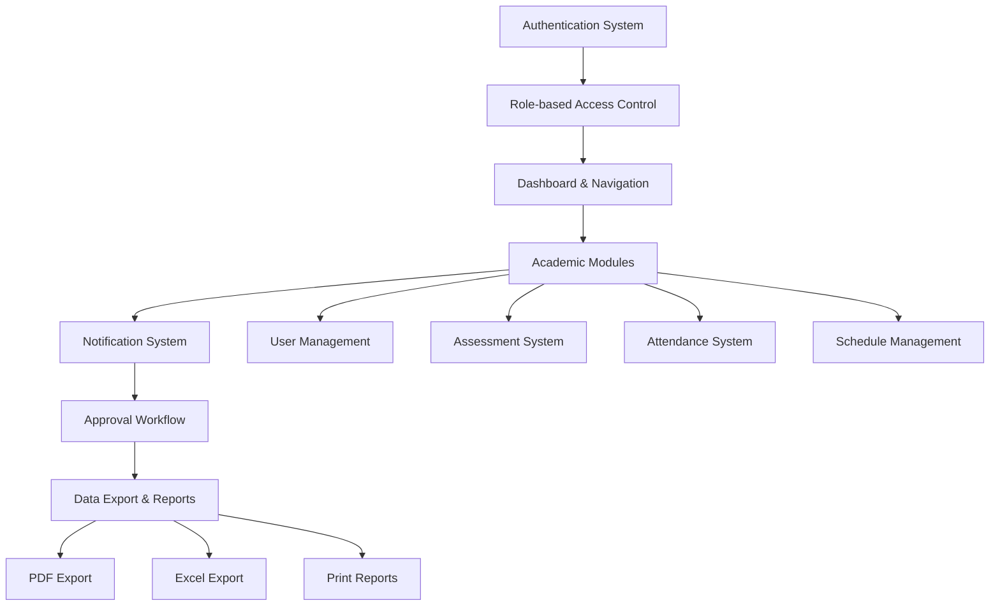

# Use Case Diagram - SIAKAD SMAN 1 Kota Dumai

## Overview
Sistem Informasi Akademik (SIAKAD) SMAN 1 Kota Dumai adalah aplikasi web berbasis Laravel yang dirancang untuk mengelola kegiatan akademik sekolah dengan 4 role utama: Kepala Tata Usaha, Tata Usaha, Guru, dan Murid.

## Actors (Pengguna Sistem)

### 1. Kepala Tata Usaha (Administrator)
- **Akses**: Penuh ke seluruh sistem
- **Peran**: Mengelola keseluruhan sistem dan pengaturan sekolah

### 2. Tata Usaha (Staff Administrasi)
- **Akses**: Terbatas ke beberapa menu sistem
- **Peran**: Membantu administrasi dan monitoring sistem

### 3. Guru
- **Akses**: Dashboard, data siswa, jadwal, mata pelajaran, penilaian, absensi
- **Peran**: Mengajar dan mengelola kelas

### 4. Murid (Siswa)
- **Akses**: Terbatas untuk melihat jadwal, nilai, dan profile
- **Peran**: Mengakses informasi akademik pribadi

---

## Use Cases by Module

### 🔐 **Authentication & Authorization**
```
┌─────────────────────────────────────────────────────────┐
│                    Authentication                        │
├─────────────────────────────────────────────────────────┤
│ UC001: Login ke Sistem                                  │
│ UC002: Logout dari Sistem                               │
│ UC003: Reset Password                                   │
│ UC004: Verifikasi Role dan Permission                   │
└─────────────────────────────────────────────────────────┘

Actors: Semua Role (Kepala Tata Usaha, Tata Usaha, Guru, Murid)
```

### 👥 **User Management**
```
┌─────────────────────────────────────────────────────────┐
│                  User Management                         │
├─────────────────────────────────────────────────────────┤
│ UC005: Kelola Data Guru                                 │
│ UC006: Tambah Guru Baru                                 │
│ UC007: Edit Data Guru                                   │
│ UC008: Hapus Data Guru                                  │
│ UC009: Lihat Detail Guru                                │
└─────────────────────────────────────────────────────────┘

Primary Actors: Kepala Tata Usaha, Tata Usaha
Secondary Actors: Guru (read-only)
```

### 🎓 **Student Management**
```
┌─────────────────────────────────────────────────────────┐
│                 Student Management                       │
├─────────────────────────────────────────────────────────┤
│ UC010: Kelola Data Siswa                                │
│ UC011: Tambah Siswa Baru                                │
│ UC012: Edit Data Siswa                                  │
│ UC013: Hapus Data Siswa                                 │
│ UC014: Import Data Siswa                                │
│ UC015: Buat Akun Login untuk Siswa                      │
│ UC016: Kelola Profile Siswa (Murid)                     │
└─────────────────────────────────────────────────────────┘

Primary Actors: Kepala Tata Usaha, Tata Usaha
Secondary Actors: Guru (read-only), Murid (profile only)
```

### 🏫 **Class Management**
```
┌─────────────────────────────────────────────────────────┐
│                  Class Management                        │
├─────────────────────────────────────────────────────────┤
│ UC017: Kelola Data Kelas                                │
│ UC018: Tambah Kelas Baru                                │
│ UC019: Edit Data Kelas                                  │
│ UC020: Hapus Data Kelas                                 │
│ UC021: Assign Wali Kelas                                │
│ UC022: Remove Wali Kelas                                │
│ UC023: Lihat Detail Kelas                               │
└─────────────────────────────────────────────────────────┘

Primary Actors: Kepala Tata Usaha, Tata Usaha
Secondary Actors: Guru (read-only)
```

### 📚 **Subject Management**
```
┌─────────────────────────────────────────────────────────┐
│                 Subject Management                       │
├─────────────────────────────────────────────────────────┤
│ UC024: Kelola Mata Pelajaran                            │
│ UC025: Tambah Mata Pelajaran                            │
│ UC026: Edit Mata Pelajaran                              │
│ UC027: Hapus Mata Pelajaran                             │
│ UC028: Lihat Daftar Mata Pelajaran                      │
└─────────────────────────────────────────────────────────┘

Primary Actors: Kepala Tata Usaha, Tata Usaha
Secondary Actors: Guru (read-only), Murid (read-only)
```

### 📅 **Schedule Management**
```
┌─────────────────────────────────────────────────────────┐
│                Schedule Management                       │
├─────────────────────────────────────────────────────────┤
│ UC029: Kelola Jadwal Pelajaran                          │
│ UC030: Tambah Jadwal Pelajaran                          │
│ UC031: Edit Jadwal Pelajaran                            │
│ UC032: Hapus Jadwal Pelajaran                           │
│ UC033: Lihat Jadwal Mengajar (Guru)                     │
│ UC034: Lihat Jadwal Kelas (Murid)                       │
│ UC035: Filter Jadwal by Kelas/Guru/Hari                 │
└─────────────────────────────────────────────────────────┘

Primary Actors: Kepala Tata Usaha, Tata Usaha
Secondary Actors: Guru (read jadwal mengajar), Murid (read jadwal kelas)
```

### 📝 **Assessment System**
```
┌─────────────────────────────────────────────────────────┐
│                  Assessment System                       │
├─────────────────────────────────────────────────────────┤
│ UC036: Input Nilai Siswa                                │
│ UC037: Edit Nilai Siswa                                 │
│ UC038: Hapus Nilai Siswa                                │
│ UC039: Lihat Progress Input Nilai                       │
│ UC040: Export Nilai ke Excel/PDF                        │
│ UC041: Lihat Nilai Pribadi (Murid)                      │
│ UC042: Export Rapor (Murid)                             │
│ UC043: Request Approval untuk Edit Nilai                │
└─────────────────────────────────────────────────────────┘

Primary Actors: Guru, Kepala Tata Usaha
Secondary Actors: Murid (read nilai pribadi)
Special: Approval system untuk edit nilai
```

### 🎯 **KKM Management**
```
┌─────────────────────────────────────────────────────────┐
│                   KKM Management                         │
├─────────────────────────────────────────────────────────┤
│ UC044: Kelola KKM Mata Pelajaran                        │
│ UC045: Set KKM per Mata Pelajaran per Kelas             │
│ UC046: Edit KKM                                         │
│ UC047: Hapus KKM                                        │
│ UC048: Bulk Import KKM                                  │
│ UC049: Bulk Delete KKM                                  │
└─────────────────────────────────────────────────────────┘

Primary Actors: Guru (mata pelajaran yang diajar), Kepala Tata Usaha, Tata Usaha
Constraints: Guru hanya bisa mengelola KKM mata pelajaran yang diajar
```

### 📋 **Attendance System**
```
┌─────────────────────────────────────────────────────────┐
│                 Attendance System                        │
├─────────────────────────────────────────────────────────┤
│ UC050: Input Absensi Siswa                              │
│ UC051: Edit Absensi Siswa                               │
│ UC052: Hapus Absensi Siswa                              │
│ UC053: Lihat Rekap Absensi Harian                       │
│ UC054: Lihat Rekap Absensi Bulanan                      │
│ UC055: Monitoring Absensi Real-time                     │
│ UC056: Export Laporan Absensi                           │
│ UC057: Lihat Absensi Pribadi (Murid)                    │
│ UC058: Reset Form Absensi                               │
└─────────────────────────────────────────────────────────┘

Primary Actors: Guru (input absensi kelas yang diajar)
Secondary Actors: Kepala Tata Usaha, Tata Usaha (monitoring & laporan)
Tertiary Actors: Murid (lihat absensi pribadi)
```

### ✅ **Approval System**
```
┌─────────────────────────────────────────────────────────┐
│                  Approval System                         │
├─────────────────────────────────────────────────────────┤
│ UC059: Ajukan Permintaan Persetujuan                    │
│ UC060: Lihat Daftar Permintaan Persetujuan              │
│ UC061: Approve Permintaan                               │
│ UC062: Reject Permintaan                                │
│ UC063: Lihat Status Permintaan Pribadi                  │
│ UC064: Terima Notifikasi Permintaan                     │
└─────────────────────────────────────────────────────────┘

Primary Actors: Tata Usaha (approve/reject)
Secondary Actors: Semua role (ajukan permintaan & lihat status)
```

### 🔔 **Notification System**
```
┌─────────────────────────────────────────────────────────┐
│                Notification System                       │
├─────────────────────────────────────────────────────────┤
│ UC065: Lihat Notifikasi                                 │
│ UC066: Mark Notifikasi sebagai Dibaca                   │
│ UC067: Mark Semua Notifikasi sebagai Dibaca             │
│ UC068: Hapus Notifikasi                                 │
│ UC069: Terima Push Notification                         │
│ UC070: Lihat Jumlah Unread Notifications                │
└─────────────────────────────────────────────────────────┘

Actors: Semua Role
Types: Approval notifications, Wali Kelas assignments, System notifications
```

### ⚙️ **System Settings**
```
┌─────────────────────────────────────────────────────────┐
│                  System Settings                         │
├─────────────────────────────────────────────────────────┤
│ UC071: Kelola Pengaturan Sekolah                        │
│ UC072: Set Tahun Ajaran Aktif                           │
│ UC073: Set Semester Aktif                               │
│ UC074: Update Informasi Sekolah                         │
│ UC075: Kelola Konfigurasi Sistem                        │
└─────────────────────────────────────────────────────────┘

Primary Actors: Kepala Tata Usaha (exclusive access)
```

### 🔍 **Search & Reporting**
```
┌─────────────────────────────────────────────────────────┐
│               Search & Reporting                         │
├─────────────────────────────────────────────────────────┤
│ UC076: Global Search                                    │
│ UC077: Search Siswa                                     │
│ UC078: Search Guru                                      │
│ UC079: Search Mata Pelajaran                            │
│ UC080: Generate Dashboard Statistics                    │
│ UC081: View Recent Activities                           │
│ UC082: Export Data Reports                              │
└─────────────────────────────────────────────────────────┘

Actors: Semua Role (dengan batasan akses data sesuai role)
```

### 👤 **Profile Management**
```
┌─────────────────────────────────────────────────────────┐
│                Profile Management                        │
├─────────────────────────────────────────────────────────┤
│ UC083: Edit Profile Pribadi                             │
│ UC084: Ganti Password                                   │
│ UC085: Upload Foto Profile                              │
│ UC086: Update Informasi Kontak                          │
│ UC087: View Profile Information                         │
└─────────────────────────────────────────────────────────┘

Actors: Semua Role
Special: Murid memiliki form profile khusus dengan batasan field yang bisa diedit
```

---

## 🎯 Use Case Relationships & Dependencies

### **Include Relationships**
- Semua use case **INCLUDE** → UC004: Verifikasi Role dan Permission
- UC011, UC025, UC030 **INCLUDE** → UC004: Validasi Data Input
- UC036, UC050 **INCLUDE** → Validasi Jadwal Mengajar
- UC059 **INCLUDE** → UC064: Kirim Notifikasi

### **Extend Relationships**
- UC036: Input Nilai **EXTENDS** → UC043: Request Approval (jika edit nilai lama)
- UC050: Input Absensi **EXTENDS** → UC058: Reset Form (setelah save)
- UC021: Assign Wali Kelas **EXTENDS** → UC064: Kirim Notifikasi

### **Generalization**
- UC005-UC009 (Kelola Guru) **GENERALIZES** → User Management
- UC010-UC016 (Kelola Siswa) **GENERALIZES** → User Management
- UC036-UC043 (Penilaian) **GENERALIZES** → Academic Management

---

## 🔒 Security & Access Control Matrix

| Use Case Category | Kepala Tata Usaha | Tata Usaha | Guru | Murid |
|-------------------|-------------------|------------|------|-------|
| User Management   | ✅ Full Access    | ✅ Full Access | 👁️ Read Only | ❌ No Access |
| Student Management| ✅ Full Access    | ✅ Full Access | 👁️ Read Only | 👤 Profile Only |
| Class Management  | ✅ Full Access    | ✅ Full Access | 👁️ Read Only | ❌ No Access |
| Subject Management| ✅ Full Access    | ✅ Full Access | 👁️ Read Only | 👁️ Read Only |
| Schedule Management| ✅ Full Access   | ✅ Full Access | 👁️ Teaching Schedule | 👁️ Class Schedule |
| Assessment System | ✅ Full Access    | ❌ No Access | ✅ Teaching Subjects | 👁️ Own Grades |
| KKM Management    | ✅ Full Access    | ✅ Full Access | ✅ Teaching Subjects | ❌ No Access |
| Attendance System | 👁️ Reports Only  | 👁️ Reports Only | ✅ Input & Reports | 👁️ Own Attendance |
| Approval System   | 👁️ View Only     | ✅ Approve/Reject | ✅ Request Only | ✅ Request Only |
| System Settings   | ✅ Full Access    | ❌ No Access | ❌ No Access | ❌ No Access |

**Legend:**
- ✅ Full Access (Create, Read, Update, Delete)
- 👁️ Read Only Access
- 👤 Limited Personal Access
- ❌ No Access

---

## 🚀 Key Features & Innovations

### **Smart Form Management**
- **Auto-reset forms** setelah input berhasil
- **Real-time validation** dengan feedback visual
- **Bulk operations** untuk efisiensi

### **Advanced Filtering & Search**
- **Global search** across multiple entities
- **Role-based filtering** - guru hanya lihat kelas yang diajar
- **Progressive search** dengan autocomplete

### **Responsive Design**
- **Mobile-optimized** interface untuk semua role
- **Touch-friendly** controls
- **Progressive enhancement** untuk berbagai ukuran layar

### **Real-time Features**
- **Live notifications** untuk approval requests
- **Real-time attendance monitoring**
- **Dynamic dashboard statistics**

### **Academic Workflow**
- **Approval system** untuk perubahan nilai
- **Automatic account creation** untuk siswa baru
- **Semester-based** data management

---

## 📊 System Integration Points



---

## 🎯 Business Rules & Constraints

### **Data Integrity Rules**
1. Guru hanya bisa input nilai/absensi untuk mata pelajaran yang diajar
2. Siswa hanya bisa melihat data akademik pribadi
3. Wali kelas assignment harus unique per kelas
4. KKM harus diset sebelum input nilai
5. Kapasitas kelas tidak boleh exceeded

### **Workflow Rules**
1. Edit nilai lama memerlukan approval dari Tata Usaha
2. Notifikasi otomatis untuk assignment wali kelas
3. Password default siswa menggunakan tanggal lahir
4. Session management dengan proper logout handling

### **Security Rules**
1. Role-based middleware protection
2. CSRF protection untuk semua forms
3. Input validation & sanitization
4. Secure file upload untuk photos

---

**Dibuat untuk**: SIAKAD SMAN 1 Kota Dumai  
**Platform**: Laravel 11 + Vue 3 + Inertia.js + Tailwind CSS  
**Database**: SQLite  
**Tanggal**: Agustus 2025
